# Aktos API

This project is a Django-based API for managing client accounts and consumer data.

## Requirements

- [Docker](https://www.docker.com/get-started)
- [Docker Compose](https://docs.docker.com/compose/install/)
- [Python 3.12+](https://www.python.org/downloads/)
- [Poetry](https://python-poetry.org/docs/#installation)

## Setup

1. Clone the repository:
   ```
   git clone https://github.com/your-username/aktos-api.git
   cd aktos-api
   ```

2. Build and start the Docker containers:
   ```
   docker compose up --build
   ```

3. Run migrations:
   ```
   docker compose exec web poetry run python manage.py migrate
   ```

4. Create a superuser (optional):
   ```
   docker compose exec web poetry run python manage.py createsuperuser
   ```

## Running the API

The API will be available at `http://localhost:8000`.

### Endpoints

1. Ingest Accounts:
   - URL: `GET /accounts/ingest?url=<csv_url>`
   - Description: Ingests account data from a CSV file at the specified URL.

2. Get Accounts:
   - URL: `GET /accounts`
   - Query Parameters:
     - `min_balance`: Minimum account balance (inclusive)
     - `max_balance`: Maximum account balance (inclusive)
     - `consumer_name`: Filter by consumer name (case-insensitive, partial match)
     - `status`: Filter by account status (case-insensitive, exact match)
   - Description: Retrieves accounts based on the provided filters.

## Testing the API

You can test the API using [curl](https://curl.se/) or any API testing tool like [Postman](https://www.postman.com/). Here are some example curl commands:

1. Ingest Accounts:
   ```
   curl "http://localhost:8000/accounts/ingest?url=https://example.com/path/to/your/csv/file.csv"
   ```

2. Get Accounts:
   ```
   curl "http://localhost:8000/accounts?min_balance=100&max_balance=1000&status=in_collection"
   ```

   ```
   curl "http://localhost:8000/accounts?min_balance=100.23&status=collected&consumer_name=john"
   ```

### Running Unit Tests

To run the unit tests for this project:

```
docker compose exec web poetry run python manage.py test
```

## Development

To run the development server:

```
docker compose up
```

## Troubleshooting

If you encounter any issues, please check the Docker logs:

```
docker compose logs
```

## Contributing

Please read CONTRIBUTING.md for details on our code of conduct, and the process for submitting pull requests.

## License

This project is licensed under the MIT License - see the LICENSE.md file for details.

## Data Model

Our application's data structure is modeled as follows:

```mermaid
erDiagram
    CLIENT {
        string client_reference_no PK
        datetime created_at
        datetime updated_at
    }
    CONSUMER {
        string ssn PK
        string name
        text address
        datetime created_at
        datetime updated_at
    }
    ACCOUNT {
        uuid account_id PK
        decimal balance
        string status
        datetime created_at
        datetime updated_at
        string client_reference_no FK
        string ssn FK
    }
    CLIENT ||--o{ ACCOUNT : has
    CONSUMER ||--o{ ACCOUNT : has
```



This diagram illustrates the relationships between our main entities: CLIENT, CONSUMER, and ACCOUNT. Each CLIENT and CONSUMER can have multiple ACCOUNTs, while each ACCOUNT is associated with one CLIENT and one CONSUMER.
